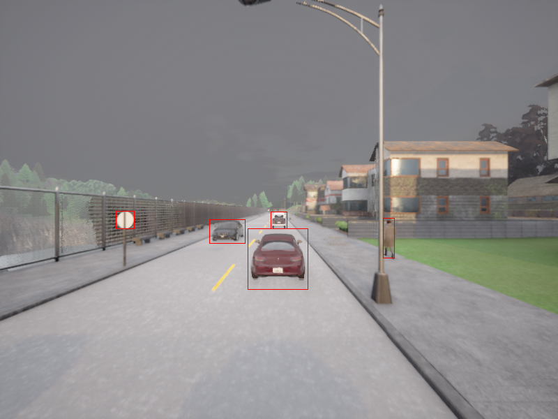

# Multi-Class Object Localization in CARLA Using YoloV8



This repository provides some useful tools to generate a dataset of annotated images for use in training a YOLO object detector. Data collection is done in the [CARLA](https://carla.org//) simulator (v0.9.15), and the YOLOv8 model is trained using the [Ultralytics](https://docs.ultralytics.com) API.

## Overview

[Installation](#Installation)  
[Quick Start](#Quick-Start)  
[Dataset Customization](#Dataset-Customization)  
[Acknowledgements](#Acknowledgements)  

## Installation

This code has been tested on:
- **Ubuntu** 18.04 / 22.04
- **CARLA** 0.9.15
- **Python** 3.10.x

### Installing CARLA
Follow [these](https://carla.readthedocs.io/en/0.9.15/start_quickstart/) instructions to install the CARLA simulation environment. For a quick setup, you may also [run CARLA through Docker](https://carla.readthedocs.io/en/0.9.15/build_docker/).

### Setting up Environment
```
git clone https://github.com/RyangDiaz/carla-yolo-dataset-generator.git
cd carla-yolo-dataset-generator
conda env create -f environment.yml
conda activate carla
```

If not using conda, then

```
pip install -r requirements.txt
```

## Usage
First, modify the `LAUNCH_STRING` variable of `utils/server_utils.py` to the appropriate launch command so that the script can automatically launch a Carla server for you.

### Quick Start
To automatically generate a dataset of 1250 images (800 train, 200 validation, 250 test) spanning five different maps (`Town01` to `Town05`) and train a YOLOv8 model on this dataset:

```
bash collect_data_and_train.sh
```

You can then run inference on the trained model over `NUM_STEPS` and visualize/save prediction frames as a video:

```
python yolo_realtime_inference.py --model PATH/TO/TRAINED/MODEL.pt --num_steps NUM_STEPS --map Town05 --show --save_video
```

This trained detector currently has four classes: `vehicle`, `pedestrian`, `traffic_light`, and `traffic_sign`. You can customize the classes of objects annotated by using the bounding box filtering functions provided in this repository (described below).

### Dataset Customization

**Dataset Collection Parameters**

You can modify the characteristics of your dataset by passing arguments to `collect_yolo_data.py`:

- `--map {MAP}`: The dataset will be collected in the map `MAP` (see a list [here](https://carla.readthedocs.io/en/latest/core_map/#non-layered-maps)).
- `--constant_weather`: Keeps constant weather during collection. By default, the dataset collector will switch the simulation's weather every few collected frames.
- `--num_save {N}`: If `--save` is passed in, the dataset collector will run until `N` frames have been collected.
- `--num_detections_save {N}`: Each collected frame will have a minimum of `N` bounding boxes (across all classes).

After data collection, use `convert_dataset.py` to transform the collected dataset into a format compatible with the YOLO model trainer. Use `train_yolo.py` to run the training script.

**Adding New Classes**

To add new classes of actors/objects for annotation, modify the `collect_yolo_data.py` file by adding one of the functions from `utils/bbox_utils.py` depending on if your class involves actors or level objects in the CARLA simulation. Follow the pattern shown in `collect_yolo_data.py`. Additionally, be sure to modify the `carla.yaml` configuration file with your new classes/labels so that the YOLO model can predict them.

Bounding box filtering of non-occluded actors (such as vehicles and pedestrians) can be done in two ways: lidar-based filtering or depth/semantic-based filtering:

*Lidar-Based Actor Bounding Box Filtering*

```
bbox_utils.actor_bbox_lidar(
    actor_list, # List of filtered actors (probably from world.get_actors().filter('FILTER'))
    camera, # RGB camera from environment
    image, # carla.Image taken from RGB camera
    lidar_image, # carla.SemanticLidarMeasurement taken from lidar sensor
    max_dist, # Maximum distance to annotate away from ego vehicle
    min_detect, # Argument for cva_utils.auto_annotate_lidar
    class_id # Integer label for YOLO classifier
)
```

*Semantic/Depth-Based Actor Bounding Box Filtering*

```
bbox_utils.actor_bbox_depth_semantic(
    actor_list, # List of filtered actors (probably from world.get_actors().filter('FILTER'))
    camera, # RGB camera from environment
    image, # carla.Image taken from RGB camera
    semantic_image, # carla.Image taken from semantic segmentation camera
    depth_image, # Depth reading in meters obtained from cva_utils.extract_depth(depth_image)
    max_dist, # Maximum distance to annotate away from ego vehicle
    depth_margin, # Argument for cva_utils.auto_annotate
    patch_ratio, # Argument for cva_utils.auto_annotate_lidar
    resize_ratio, # Argument for cva_utils.auto_annotate_lidar
    semantic_label, # Integer semantic label from semantic_image corresponding to desired class
    semantic_threshold, # Minimum semantic label threshold for bounding box filter
    class_id # Integer label for YOLO classifier
)
```

Bounding box filtering of non-occluded level objects (such as traffic lights and traffic signs) is done through depth/semantic-based filtering:

*Semantic/Depth-Based Object Bounding Box Filtering*

```
bbox_utils.object_bbox_depth_semantic(
    bbox_list, # List of filtered bounding boxes (probably from world.get_level_bbs(FILTER))
    camera, # RGB camera from environment
    image, # carla.Image taken from RGB camera
    semantic_image, # carla.Image taken from semantic segmentation camera
    depth_image, # Depth reading in meters obtained from cva_utils.extract_depth(depth_image)
    vehicle, # Ego vehicle from simulation
    max_dist, # Maximum distance to annotate away from ego vehicle
    semantic_label, # Integer semantic label from semantic_image corresponding to desired class
    semantic_threshold, # Minimum semantic label threshold for bounding box filter
    class_id # Integer label for YOLO classifier
)
```

For more information on the algorithms used to filter out bounding boxes, check out the [CARLA-2DDBBox](https://github.com/MukhlasAdib/CARLA-2DBBox) repository.

### Acknowledgements

The tools in this repo were built off of work done previously in CARLA dataset collection for object detection tasks:

- [CARLA-2DDBBox](https://github.com/MukhlasAdib/CARLA-2DBBox)
- [CARLA-Automatic-Dataset-Collector](https://github.com/LinkouCommander/CARLA-Automatic-Dataset-Collector)
- [Bounding box tutorial provided by CARLA](https://carla.readthedocs.io/en/latest/tuto_G_bounding_boxes/)
